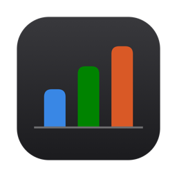
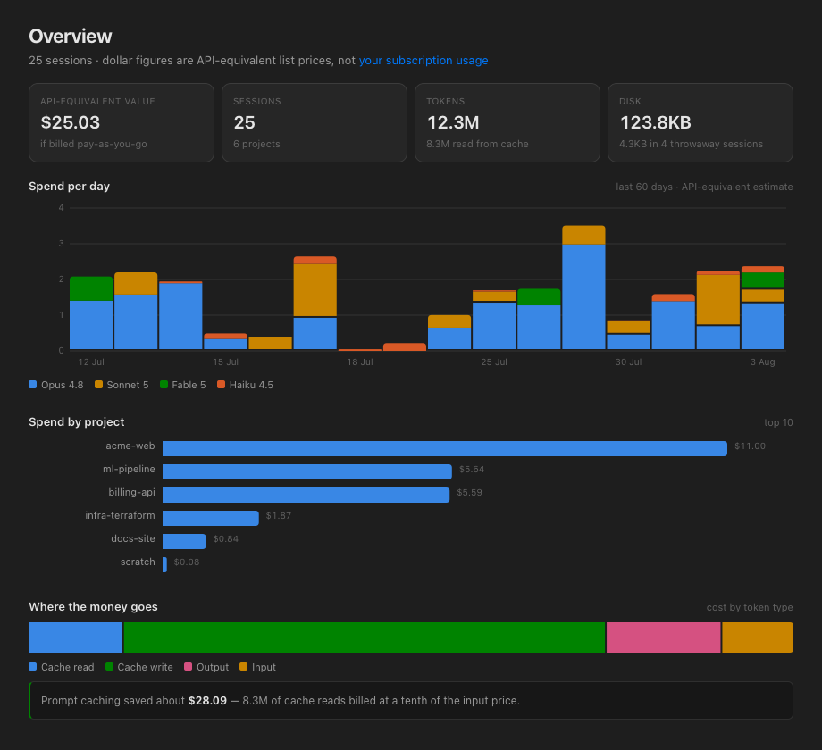
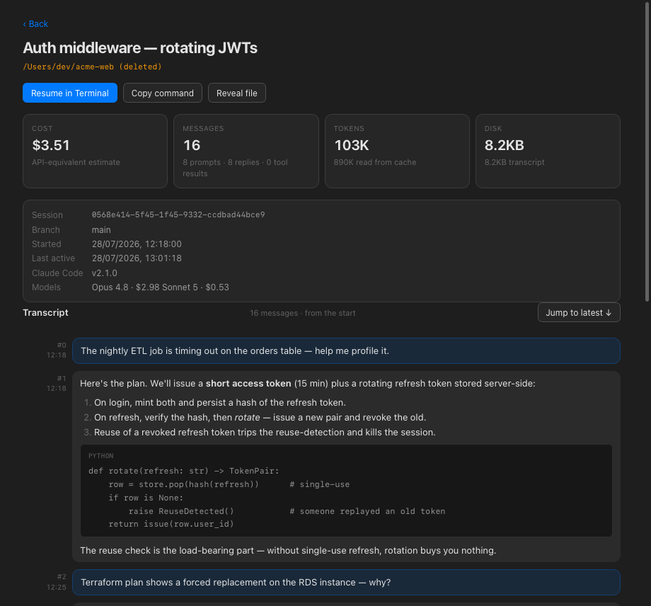
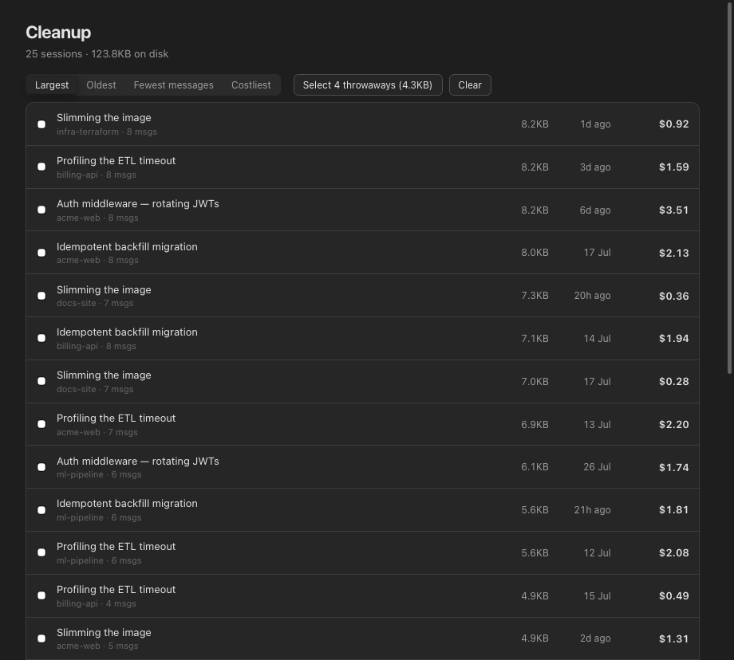
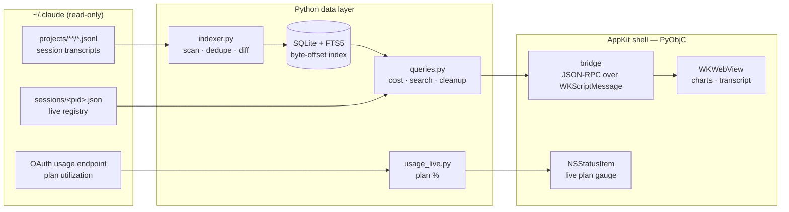

<p align="center">
  
</p>

<h1 align="center">Purser</h1>

<p align="center">
  Session ledger for Claude Code — browse, search, cost and clean up every session,
  with a live menu-bar readout of how much of your plan you've spent.
  <br />
  <a href="#why">Why</a> ·
  <a href="#what-it-does">What it does</a> ·
  <a href="#safety">Safety</a> ·
  <a href="#architecture">Architecture</a> ·
  <a href="#getting-started">Getting started</a>
</p>

<p align="center">
  
  
  
  
</p>

<p align="center">
  <a href="https://github.com/onembyte/purser/releases/latest/download/Purser-macOS.dmg">
    
  </a>
  <br />
  <sub>Not yet notarized — after dragging to Applications, run the one-line command in <a href="#install">Install</a>.</sub>
</p>

<p align="center">
  
</p>
<p align="center">
  
  
</p>
<p align="center"><sub>Screenshots use a synthetic corpus — Purser reads your own <code>~/.claude</code> locally and nothing leaves the machine.</sub></p>

## Install

Download the DMG above, drag **Purser** to Applications, then run this once:

```bash
xattr -d com.apple.quarantine /Applications/Purser.app
```

Then open it normally. (If it replies `No such xattr`, the tag was already gone —
just open the app.)

<details>
<summary><b>Why is that needed — and is it safe?</b></summary>

macOS tags everything a browser downloads with a `com.apple.quarantine`
attribute. Apps that aren't **notarized** by Apple are refused — often with the
misleading message *"Purser is damaged and can't be opened"*. Nothing is damaged,
and right-click → Open does **not** get past it for an unnotarized app. The
command above removes the download tag — the same decision you make when you click
through any "open anyway" dialog.

Note the command is `-d`, not `-dr`: older macOS ships an `xattr` without the
recursive `-r` flag, and clearing the tag on the bundle itself is what Gatekeeper
checks anyway.

Notarization needs a paid Apple Developer account; it's on the roadmap. Until
then you're trusting this repo — the build is ad-hoc signed (it passes
`codesign --verify --deep --strict`) and reproducible from source with
`setup.py py2app`, and everything Cleanup can remove is covered by the
[safety model](#safety). If you'd rather not run a downloaded binary, build it
yourself — the [Getting started](#getting-started) steps produce the same app.

</details>

## Why

Claude Code writes every session to `~/.claude` as JSONL and never looks back. Over a
few months that becomes hundreds of sessions and hundreds of megabytes, with no way to
answer the questions that actually matter: *where did the tokens go, which project is
expensive, what can I safely delete, and how much of my plan have I burned this week?*

Purser turns that pile of logs into a ledger. It's a **native macOS app** — an AppKit
shell (PyObjC) wrapped around a WKWebView content pane — with no Electron, no bundled
web server, and no network access beyond Anthropic's own usage endpoint. It also exists
to show how far a genuinely native-feeling Mac app can go while being written entirely
in Python.

## What it does

| View | |
|---|---|
| **Overview** | API-equivalent value, daily spend stacked by model, spend per project, a token-type breakdown, and how much prompt caching saved you |
| **Projects** | every session grouped by working directory, with a live badge on sessions that are running right now |
| **Session** | cost / token / disk cards, full metadata, and the entire transcript paged straight out of the `.jsonl` — markdown, code blocks and all |
| **Search** | full-text across every transcript, jump straight to the matching message |
| **Plan usage** | your real subscription utilization — 5-hour and weekly windows — read from Claude Code and, when available, live from Anthropic |
| **Cleanup** | triage by size / age / message count / cost, then move throwaways to the Trash (recoverable) |

- **Live plan meter in the menu bar.** A glanceable `NSStatusItem` shows the percentage
  of your binding limit while you work, coloured green → orange → red, so you see the
  plan filling up without opening anything.
- **Resume in one click.** Opens a new Terminal window at the session's working
  directory and runs `claude --resume <id>` — or copies the command if you'd rather.
- **Honest about money.** You're on a subscription, so every dollar figure is captioned
  as an *API-equivalent list price*, not a bill — a way to compare sessions, not a
  charge.

## Safety

Cleanup is the only part of Purser that can remove anything, and it's built to make
removing the wrong thing structurally hard:

| Rule | Enforcement |
|---|---|
| Trash, never `rm` | Everything goes to the Finder Trash via `NSFileManager` — fully recoverable, no direct deletes |
| Inside `~/.claude` only | Every path is re-checked against the Claude root before it's touched; anything outside is refused |
| Never a live session | Liveness is re-checked at click time against the `sessions/<pid>.json` registry, not trusted from the rendered list |
| Shared history untouched | `~/.claude/file-history` is never a target |
| No path from the UI | The web layer can only send a session **id** over the bridge — paths and sizes come from the backend's own index |
| Transcript can't inject markup | Assistant text is rendered from DOM nodes, not `innerHTML`; only `http(s)` links are clickable |
| Local by default | The only network call is the read-only plan-usage endpoint; its token is read from the Keychain at runtime and never stored |

## How it works

`~/.claude/projects/<encoded-cwd>/<uuid>.jsonl` is the source of truth; the SQLite index
in `~/Library/Application Support/Purser/` is a **disposable cache** — on schema mismatch
or corruption it is deleted and rebuilt, so there are no migrations.

Things that are less obvious than they look, and are load-bearing:

- **Sessions are deduped by sessionId across project dirs.** A session that changes cwd
  is written to two encoded directories; the larger file is canonical and the other is a
  prefix. Counting both double-counts cost.
- **A session's project is the *mode* of `cwd`, not the last value.** One real session
  changed directory 298 times across 7 dirs; last-wins would have filed it under the
  wrong project.
- **Cost includes subagent transcripts.** They live at `<uuid>/subagents/**/agent-*.jsonl`
  — including nested under `workflows/wf_*/` — and carry their own usage. Missing the
  nested ones under-counts spend by ~30%.
- **Transcripts are never stored.** `message_index` holds byte offsets, so a 90 MB /
  10k-message session pages in a few milliseconds.
- **Costs are API list prices** (`csm/config.py`), longest-prefix-matched on the model
  name, shown as an "API-equivalent estimate" because a subscription is not billed this
  way.
- **Chart colour follows the model, never its rank** (`config.MODEL_SLOT`) — otherwise a
  change in spend would repaint the series. The palette is validated for colour-vision
  deficiency in both light and dark appearances.

## Architecture

Native AppKit shell (PyObjC) · WKWebView content pane · Python data layer · SQLite/FTS5.



- **`indexer.py`** — scans newest-first on a background thread, dedupes by sessionId,
  folds subagent usage into the parent, and writes one transaction per session.
- **`parser.py`** — reads each `.jsonl` in binary so byte offsets are exact, self-heals
  the torn final line while Claude Code is still appending, and never keeps transcript
  text in memory.
- **`queries.py`** — the read API the UI talks to: overview, projects, sessions,
  byte-offset transcript paging, FTS search, cleanup candidates.
- **AppKit shell** — `NSSplitViewController` with a vibrancy source list, a unified
  toolbar with native search, a WKWebView whose only channel to Python is a JSON-RPC
  bridge, and a menu-bar status item for the live plan meter.

## Getting started

**Just want the app?** [Download the `.dmg`](https://github.com/onembyte/purser/releases/latest/download/Purser-macOS.dmg),
drag Purser to Applications, then clear the download quarantine — see [Install](#install).

**Run from source** — requires macOS and [Homebrew Python](https://formulae.brew.sh/formula/python) 3.13+:

```bash
./bootstrap.sh          # venv + pyobjc (falls back to python@3.13 if wheels lag)
.venv/bin/python app.py
```

**Build the app bundle and disk image yourself:**

```bash
.venv/bin/python tools/make_icon.py   # assets/icon.icns (drawn, not a binary asset)
.venv/bin/python setup.py py2app      # -> dist/Purser.app  (~28MB, self-contained)
scripts/make-dmg.sh                   # -> dist/Purser-macOS.dmg
```

The `.app` embeds its own Python — the venv is only needed to build it. The first
**Resume in Terminal** prompts once for Automation permission (System Settings →
Privacy & Security → Automation).

## Development

```bash
# Index without the GUI; prints per-model record counts and top sessions.
.venv/bin/python -m csm.indexer [--reset]

# Point the whole app at a COPY of ~/.claude. Always use this when testing cleanup.
export CSM_CLAUDE_ROOT=/tmp/fixture CSM_APP_SUPPORT=/tmp/fixture-support

# Generate a synthetic corpus (used for the screenshots above — no real data).
.venv/bin/python tools/make_fixture.py /tmp/purser-fixture

# Render the web pane to a PNG without Screen Recording permission.
CSM_SNAPSHOT=/tmp/x.png CSM_SNAPSHOT_DELAY=5 CSM_SNAPSHOT_QUIT=1 \
  CSM_SNAPSHOT_JS="navigate('overview', {})" .venv/bin/python app.py

# Run JS inside the real page (real CSP, real DOM) — this is how web/ is unit-tested.
CSM_EVAL_JS="return MD.render('**x**').textContent" CSM_EVAL_QUIT=1 \
  .venv/bin/python -u app.py
```

Right-click the content pane → Inspect Element for the web inspector.

## Project layout

```
app.py               NSApplication, menus, entry point
csm/config.py        paths, pricing, model->colour slots
csm/db.py            schema (cache semantics: drop & rebuild, never migrate)
csm/parser.py        streaming .jsonl parse -> summary, usage, byte offsets, FTS text
csm/indexer.py       scan, dedupe, diff, incremental reindex, background thread
csm/queries.py       read API: overview, projects, sessions, transcript, search, cleanup
csm/live.py          ~/.claude/sessions/<pid>.json -> which sessions are running
csm/plan.py          subscription utilization (5-hour + weekly windows)
csm/usage_live.py    background live plan-usage fetch (menu bar)
csm/actions.py       resume in Terminal, clipboard, Finder, Trash (guarded)
csm/ui/              AppKit shell: window, sidebar, webview, bridge, menubar, coordinator
csm/web/             the content pane (no build step, no dependencies)
tools/make_fixture.py  synthetic corpus for screenshots and demos
scripts/make-dmg.sh    package dist/Purser.app into a distributable .dmg
```

## License

[MIT](LICENSE) © 2026 Franco Michetti
